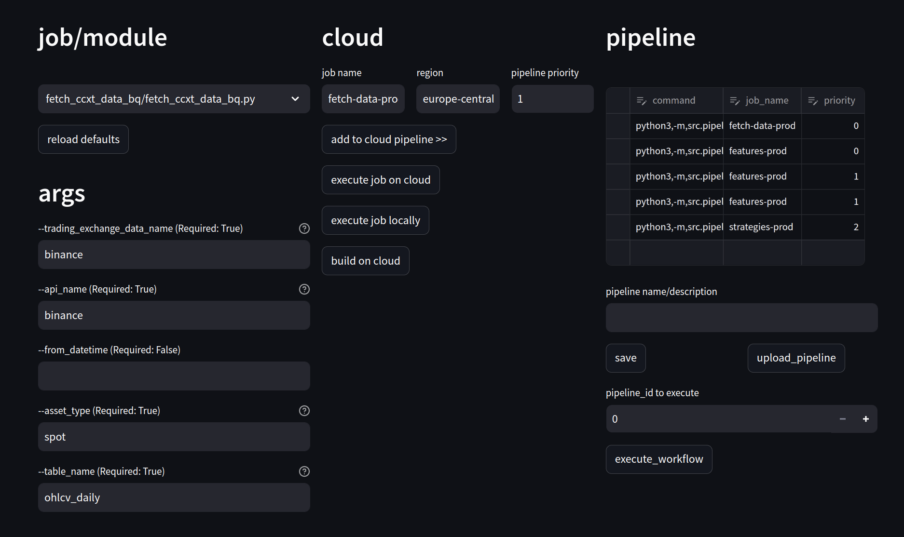

cryptorick is a Python framework for developing, researching and running quantitative crypto trading strategies. It helps build, integrate and orchestrate researching and trading components and tasks. The doc is intended to help in-house researchers start researching, developing and testing ideas, features and strategies.

Read more: https://shadymokhtar.github.io/cryptorick/

